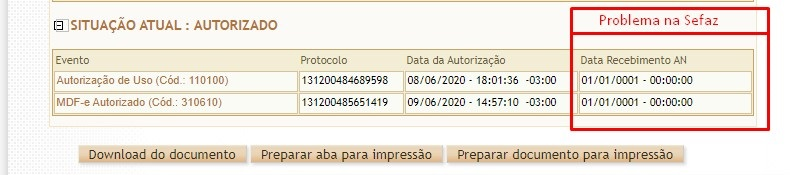

# Dúvidas Frequentes

**1. Os XMLs baixados pela funcionalidade possuem validade jurídica?**  
Sim, o XML de CT-e baixado possuí validade jurídica, pois são baixados diretamente da Sefaz.

**2. A funcionalidade baixa os XML desde quando a empresa começou a emitir CT-e?**  
Não, a Sefaz só permite que sejam baixados os XML emitidos nos últimos 90 dias. Sendo assim, esse é o limite da funcionalidade.

**3. A funcionalidade de CT-e está configurada corretamente e estava funcionado, mas parou de baixar os XMLs. E o CT-e consta no portal da Sefaz. O que pode ser?**  
O processo de integração entre a Sefaz estadual e a Sefaz nacional pode estar com problema. Com isso não é possível efetuar os downloads. Para verificar isso, entre no portal da Sefaz nacional e consulte um CT-e não está conseguindo baixar (pela chave). No Box _“SITUAÇÃO ATUAL :AUTORIZADO”_ observe a coluna _“Data Recebimento AN”_ se estiver preenchido com uma data inválida, como _“01/01/0001 – 00:00:00”_ significa que a integração entre Sefaz estadual e a Sefaz nacional está com problemas.
Exemplo
_Exemplo_

_Nesses casos você deve entrar em contato com a Sefaz de seu estado para que o serviço seja normalizado_

**4 – A Sefaz fornece algum lugar para verificar a disponibilidade dos serviços de download de NF-e ou CT-e?**  
Não, até o momento não existe um local onde possa ver a disponibilidade desses serviços, desse modo as vezes os serviços podem estar inoperantes e não ter por onde monitorar.

**5 – Aparece o seguinte erro no console ao tentar efetuar o download:”Value=“A WSDL exception occurred at0:0 WsdlParser Exception :Error sending SOAP message:Peer certificate cannot be authenticated with given CA certificates”**  
Esse erro geralmente é referente aos arquivos do certificado digital do cliente. Execute o processo descrito nos links abaixo para sanar o problema.  
> [-> Link 01 do TDN](https://centraldeatendimento.totvs.com/hc/pt-br/articles/360022658731-Cross-Segmento-TOTVS-Backoffice-Linha-Protheus-ADVPL-Peer-certificate-cannot-be-authenticated-with-given-CA-certificates)  
> [-> Link 02 do TDN](https://tdn.totvs.com/pages/viewpage.action?pageId=223932805)  
> [-> Link 03 do TDN](https://tdn.totvs.com/display/tec/Acesso+a+Web+Services+que+exigem+certificados+de+CA)  

**6 – Estou tendo as seguintes rejeições ao tentar efetuar o download:**  
“641 – Rejeição:NF-e indisponivel para o emitente”  
-> “640 – Rejeição:CNPJ/CPF do interessado não possui permissão para consultar esta NF-e”  
-> As rotinas fazem download das CT-e das quais o cnpj da empresa é o destinatário ou tomador. Caso esteja tentando efetuar o download de notas que prória empresa emitiu (de saída), ou notas emitidas para um CNPJ diferente ao da empresa, isso não será possível.

